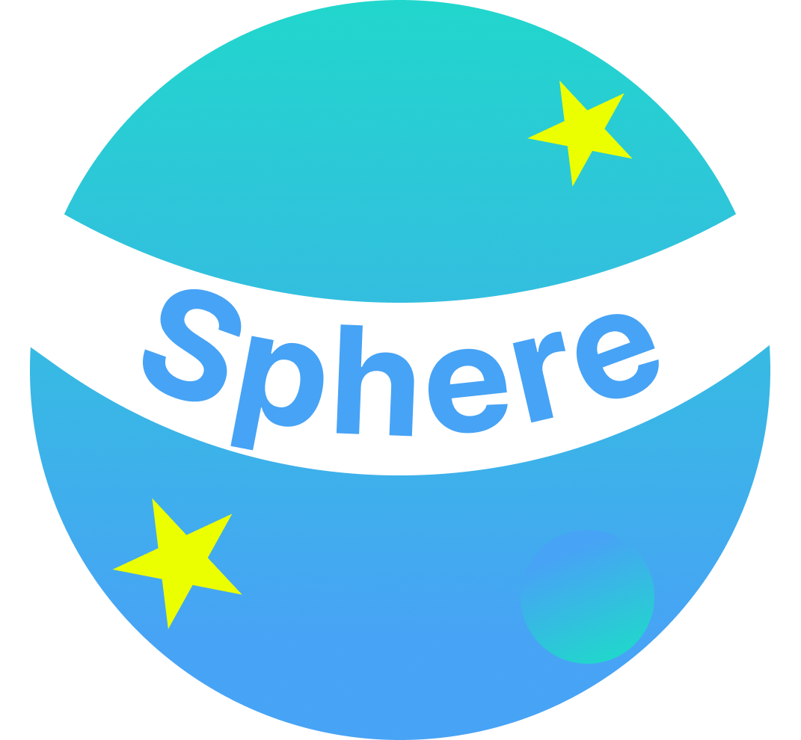
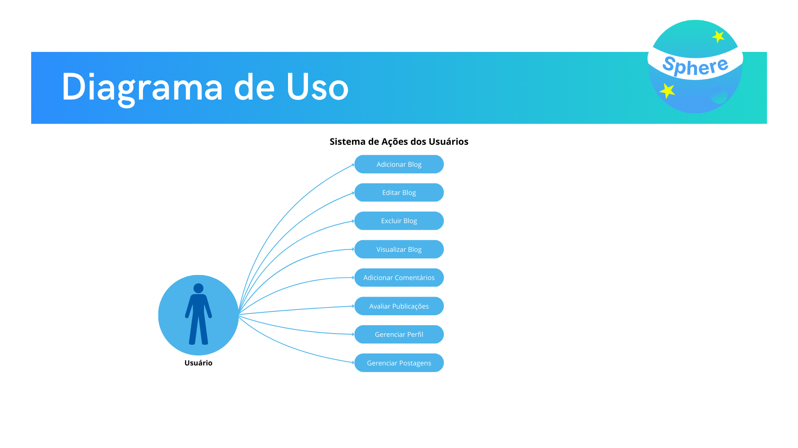
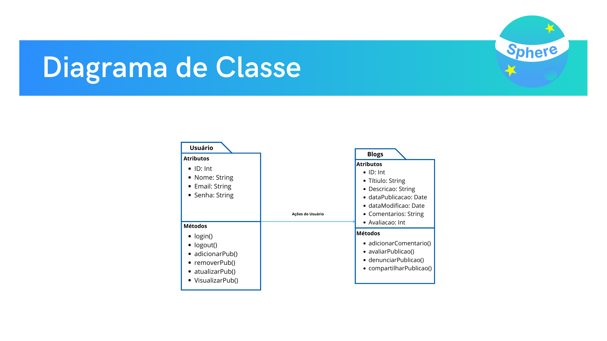
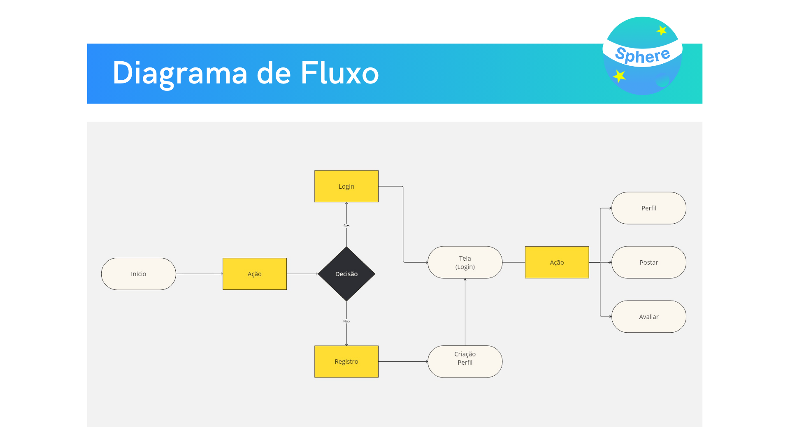

# Projeto BlogSphere
 

    
     
    <b>Sua Voz, Seu Espaço, Suas Histórias.</b>

 

>  ## _índice:_

- [Introdução](#introdução);
- [Objetivos do Projeto](#objetivos-do-projeto);
- [Cronograma](#cronograma);
- [Funcionalidades](#funcionalidades);
- [Design e Estilos](#design-e-estilos);
- [Análise de riscos](#análise-de-riscos);
- [Estrutura de Programação](#estrutura-de-programação);

>  ## _Introdução_
**Blogsphere** é uma plataforma onde pessoas podem compartilhar suas ideias, experiências e
conhecimentos através de blogs. Aqui, cada autor encontra seu espaço para se expressar
livremente e interagir com uma comunidade vibrante e diversificada, que valoriza o poder das
histórias e da troca de perspectivas. Seja para explorar, aprender ou inspirar, o **Blogsphere** é o
lugar onde sua voz ganha alcance.

 

> ## _Objetivos do Projeto_
Fornecer uma plataforma intuitiva e eficiente para a busca de conhecimento ou entreterimento dos usuários.  
Os principais objetivos desse sistema, são: 

**1. Específicos:**
Criar uma plataforma intuitiva que permita aos usuários escrever, editar e publicar seus próprios blogs, com foco em facilitar a navegação e interação.

 

**2. Mensuráveis:**
Atingir ao menos 1.000 blogs publicados no primeiro ano após o lançamento e garantir um tempo de carregamento inferior a 2 segundos para 90% das páginas.

 

**3. Atingíveis:**
Desenvolver uma interface escalável e responsiva utilizando tecnologias modernas como React e Node.js, com um sistema de gerenciamento simples para os administradores.

 

**4. Relevantes:**
Fomentar a criação de conteúdo diversificado e de qualidade, conectando autores e leitores em um espaço seguro e de confiança.

 

**5. Temporais:**
Concluir o desenvolvimento da plataforma e o lançamento da versão final em até 3 meses.

 

> ## _Cronograma_
O cronograma será divido em três meses:

### Mês 1: Planejamento e Design

**1. Semana 1-2: Pesquisa e Requisitos**
- Coleta de requisitos junto aos stakeholders.
- Definição das funcionalidades principais do site de blogs.
- Criação da documentação inicial do projeto (Introdução, Objetivos, Funcionalidades).

 

**2. Semana 3: Prototipagem de Baixa, Média e Alta Fidelidade**
- Desenvolvimento de wireframes e protótipos de baixa fidelidade para o layout do BlogSphere.
- Criação de protótipos de média fidelidade incorporando o feedback do cliente.
- Apresentação e aprovação dos protótipos pelo cliente.

 

**3. Semana 4: Configuração do Ambiente de Desenvolvimento**
- Configuração do ambiente de desenvolvimento (React, Node.js, MongoDB).
- Implementação das funcionalidades principais (CRUD de posts, sistema de comentários, interface básica do usuário).

### Mês 2: Desenvolvimento

**1. Semana 5-6: Desenvolvimento do Backend**
- Desenvolvimento das APIs em Node.js para gerenciamento de posts e comentários.
- Configuração e integração do MongoDB com o backend.

 

**2. Semana 7: Implementação de Autenticação**
- Implementação do sistema de autenticação usando JWT para acesso seguro.
- Testes iniciais de autenticação e segurança.
 

**3. Semana 8: Desenvolvimento do Frontend**
- Desenvolvimento da interface de usuário com React e Bootstrap.
- Implementação de funcionalidades dinâmicas, como atualização em tempo real de novos posts e comentários.

 

**4. Semana 9: Testes Funcionais**
- Realização de testes funcionais em todas as funcionalidades do site.
- Correção de bugs identificados durante os testes.
- Testes de usabilidade com grupos de usuários (autores e leitores).

### Mês 3: Testes e Implementação

**1. Semana 10: Testes de Segurança e Desempenho**
- Testes de segurança para garantir proteção contra injeções de código e acessos não autorizados.
- Testes de desempenho, incluindo carga e tempo de resposta do site.

 

**2. Semana 11: Ajustes Finais e Documentação**
- Realização de ajustes finais com base nos testes de funcionalidade e segurança.
- Finalização da documentação do projeto, incluindo manual de instruções e análise de riscos.
- Preparação e implementação da aplicação no ambiente de produção.

 

**3. Semana 12: Entrega do Projeto**
- Apresentação do projeto finalizado para o cliente.
- Entrega do projeto e todos os materiais/documentação para o cliente.

 

**_Cronograma de Gantt do Projeto:_**

    

 

> ## _Funcionalidades_

### _Manual de Instrução:_

**_Fluxograma de Uso:_**

    

 
Este diagrama destaca as ações possíveis para os usuários:

1. Usuário:
    - Adicionar, editar, excluir e visualizar Blogs.
    - Adicionar comentários, avaliar publicações de outros usuários.
    - Gerenciar perfil e publicações.

 

**_Fluxograma de Classe:_**

    

 
Este diagrama mostra as classes principais do sistema e como elas interagem:  

_**Usuário:**_  

A classe Usuário contém atributos essenciais para representar cada usuário do sistema. 

**Atributos:**

- ID: Identificador único do usuário.
- Nome: Nome do usuário.
- Email: Endereço de e-mail do usuário.
- Senha: Senha usada para autenticação no sistema.

**Métodos:**

- login(): Método para autenticar o usuário e permitir o acesso ao sistema.
- logout(): Método para finalizar a sessão do usuário.
- adicionarPub(): Permite que o usuário adicione uma nova publicação.
- removerPub(): Remove uma publicação existente do usuário.
- atualizarPub(): Atualiza uma publicação criada pelo usuário.
- visualizarPub(): Exibe uma lista de publicações criadas pelo usuário.

_**Blogs:**_  
A classe Blogs gerencia as publicações feitas pelos usuários no sistema. 

**Atributos:**

- ID: Identificador único da publicação.
- Título: Título da publicação.
- Descricao: Conteúdo da publicação.
- dataPublicacao: Data em que a publicação foi criada.
- dataModificacao: Data da última modificação da publicação.
- Comentarios: Campo onde os usuários podem adicionar comentários à publicação.
- Avaliacao: Avaliação média atribuída pelos usuários.

**Métodos:**

- adicionarComentario(): Permite que os usuários adicionem comentários à publicação.
- avaliarPublicacao(): Permite aos usuários avaliar a publicação com base em uma escala.
- denunciarPublicacao(): Método para denunciar publicações que violam as diretrizes.
- compartilharPublicacao(): Função para compartilhar a publicação com outros usuários ou em redes sociais.

 

**_Fluxograma de Fluxo:_**

    

 

Este diagrama representa o fluxo principal do sistema BlogSphere, desde a tela de início até as principais funcionalidades disponíveis para os usuários. Abaixo estão as etapas detalhadas do fluxo:

**1. Início**: É a primeira página que o usuário acessa ao entrar no sistema. O usuário pode tomar a decisão de realizar uma ação, como se registrar ou fazer login.

**2. Ação**: Após acessar a página inicial, o usuário tem a possibilidade de escolher se deseja fazer login ou registrar uma nova conta.

**3. Decisão (Login/Registro)**: O sistema verifica se o usuário já possui uma conta:
    - Se o usuário já tiver uma conta, ele será redirecionado para a tela de login.
    - Se o usuário ainda não tiver uma conta, ele será encaminhado para a tela de registro para criar um novo perfil.

**4. Login**: Caso o usuário já tenha uma conta, ele será redirecionado para realizar o login. Após a autenticação, ele poderá acessar as funcionalidades principais da plataforma.

**5. Registro**: Se o usuário não tiver uma conta, ele será redirecionado para a tela de criação de perfil, onde poderá se cadastrar.

**6. Tela (Login)**: Após a autenticação bem-sucedida, o usuário será redirecionado para a página principal da plataforma, onde poderá realizar diversas ações.

**7. Ação**: Depois de logado, o usuário pode acessar as funcionalidades disponíveis, como:
    - **Perfil**: O usuário pode visualizar e editar seu perfil.
    - **Postar**: O usuário pode criar novos posts para compartilhar suas ideias.
    - **Avaliar**: O usuário pode avaliar os posts de outros membros da comunidade, proporcionando feedback e interação.

Este fluxo ilustra a jornada básica do usuário dentro do BlogSphere, abrangendo desde o registro ou login até as principais ações realizadas dentro da plataforma.

 

Esses diagramas juntos fornecem uma visão completa das funcionalidades e estrutura do sistema, desde a autenticação até o gerenciamento de publicações e perfis, garantindo que todos os usuários da plataforma possam realizar suas atividades de forma eficiente.

 

> ## _Design e Estilos_

 

> ## _Análise de riscos_
Aqui estão alguns possíveis problemas que podem ocorrer durante o projeto:  

**1. Riscos Funcionais:**
- Sincronização de Tarefas: Risco de falha na sincronização entre dispositivos, podendo resultar em informações desatualizadas. Mitigação: Testes extensivos de sincronização.
- Exclusão de Tarefas: Possíveis dificuldades na exclusão de tarefas, levando ao acúmulo de informações desnecessárias. Mitigação: Sistema de confirmação de exclusão e testes rigorosos.
 

**2. Riscos de Segurança:**
- Injeção de Código: Risco de inserção de scripts maliciosos nos campos de entrada. Mitigação: Validação e sanitização das entradas de dados.
- Acesso Não Autorizado: Possibilidade de acessos não autorizados a informações sensíveis. Mitigação: Autenticação segura com multifator e criptografia de dados.
 

**3. Riscos de Desempenho:**
- Lentidão no Carregamento: O aumento do número de tarefas pode causar lentidão. Mitigação: Otimização de consultas e lazy loading.
- Sobrecarga do Servidor: Acesso simultâneo por muitos usuários pode sobrecarregar o servidor. Mitigação: Balanceamento de carga e escalabilidade automática.
 

**4. Riscos de Confiabilidade:**
- Perda de Dados: Risco de perda de dados em falhas ou manutenção. Mitigação: Backups automáticos regulares.
- Atualizações Problemáticas: Atualizações podem introduzir novos bugs. Mitigação: Testes em ambiente de staging antes da produção.
 

**5. Riscos de Usabilidade:**
- Interface Complexa: Interface pode ser difícil de usar para alguns colaboradores. Mitigação: Testes de usabilidade para garantir uma interface intuitiva.
- Compatibilidade de Dispositivos: A aplicação pode não funcionar corretamente em todos os dispositivos. Mitigação: Testes de compatibilidade com diferentes dispositivos e navegadores.

 

> ## _Estrutura de Programação_
**Framework React**
 
React é uma biblioteca JavaScript amplamente utilizada para a construção de interfaces de usuário (UI) dinâmicas e interativas. Desenvolvido pelo Facebook, ele permite a criação de componentes reutilizáveis, facilitando a manutenção e a escalabilidade de projetos. React oferece uma abordagem eficiente para a atualização da UI com seu Virtual DOM, o que resulta em melhor desempenho e uma experiência de usuário mais fluida.

**Compilador Node.js**
 
Node.js é um ambiente de execução JavaScript no lado do servidor, que permite a construção de aplicações escaláveis e de alta performance. Ele é baseado no motor V8 do Google Chrome e possibilita a criação de servidores web rápidos, suportando um grande número de conexões simultâneas. Node.js é conhecido por sua eficiência em lidar com operações de I/O, tornando-o ideal para aplicações em tempo real.

**MongoDB**
 
MongoDB é um banco de dados NoSQL que armazena dados em documentos JSON-like, oferecendo flexibilidade e escalabilidade para aplicações modernas. Diferente dos bancos de dados relacionais tradicionais, o MongoDB permite a manipulação e consulta de grandes volumes de dados não estruturados de forma ágil. Sua arquitetura distribuída facilita o gerenciamento de dados em larga escala e oferece alta disponibilidade.

**Autenticador JWT**
 
JWT (JSON Web Token) é um padrão de autenticação e troca de informações seguras entre partes, utilizado principalmente em sistemas web. Ele permite a autenticação de usuários sem a necessidade de manter sessões no servidor, facilitando a escalabilidade e melhorando a segurança. O JWT contém informações codificadas sobre o usuário e sua validade, permitindo a verificação de identidade de forma simples e eficiente.

**Bootstrap**
 
Bootstrap é um popular framework de front-end utilizado para criar interfaces web responsivas e modernas. Desenvolvido pela equipe do Twitter, ele oferece uma ampla gama de componentes prontos, como botões e formulários, além de um sistema de grid flexível que facilita o design para diferentes dispositivos.

**Github**
 
Além disso, utilizamos o Git como sistema de controle de versão, permitindo o armazenamento seguro de todos os arquivos do projeto e da documentação. O Git não só facilita a colaboração entre os membros da equipe, como também assegura que todas as mudanças no código sejam registradas e possam ser revertidas, se necessário, garantindo assim um desenvolvimento mais organizado e controlado.

